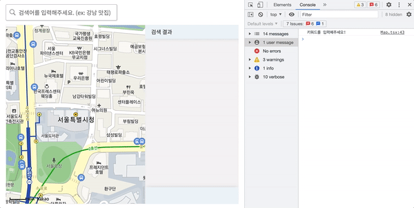
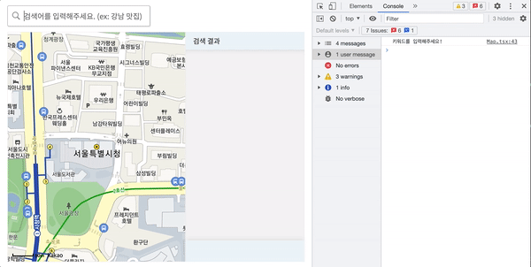
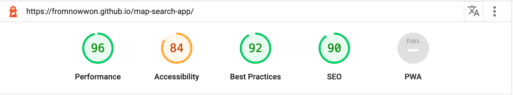

# map-search-app

📎 [Demo](https://fromnowwon.github.io/map-search-app/)

<br/>


<br />

## Introduce
Kakao API를 활용한 지도 검색 앱입니다. <br/>
키워드로 원하는 장소를 검색하면 위치와 상세 정보를 확인할 수 있습니다.

<br/>

## Tech stack
- Client: React, TypeScript, SCSS
- Backend: -
- DB: -

<br/>

## 최적화
- 검색 폼에 Lodash Debounce 메서드 적용하여 onChange 불필요한 이벤트 호출 제한
- 검색 폼에 useMemo 적용하여 리턴 값 재사용

<br/>

### Before


<br/>

### After


<br />

## 성능 측정




<br />

## Tree
```
map-search-app
├── client
│   ├── public (정적 자원 관리)
│   │   ├── images (이미지 관리)
│   │   └── index.html (지도 API 코드 입력)
│   ├── src
│   │   ├── App.tsx (컴포넌트 구성)
│   │   ├── index.tsx (App.tsx와 index.html 연결)
│   │   ├── App.scss (컴포넌트 스타일)
│   │   ├── common.scss (공통 스타일)
│   │   ├── index.scss (글로벌 스타일)
│   │   └── components
│   │       └── views
│   │           └── LandingPage
│   │               ├── LandingPage.tsx
│   │               └── Sections
│   │                   └── Map.tsx (지도 영역)
│   ├── package-lock.json
│   └── package.json
├── package-lock.json
└── package.json
```